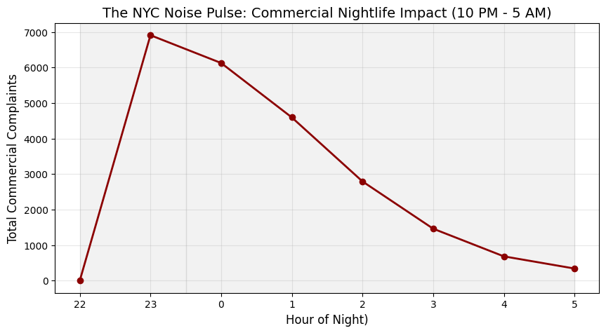
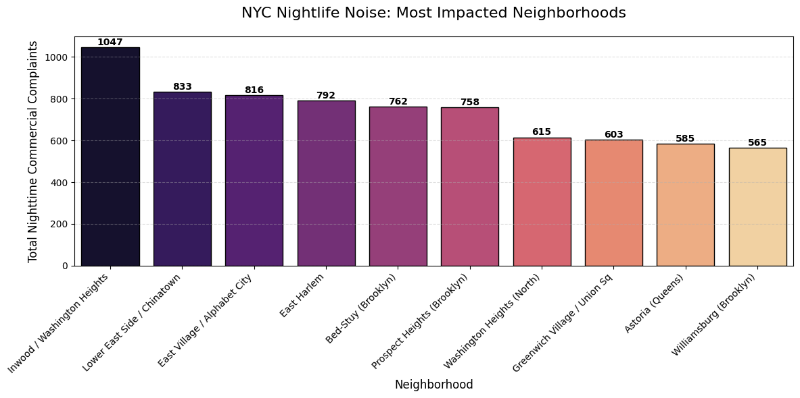
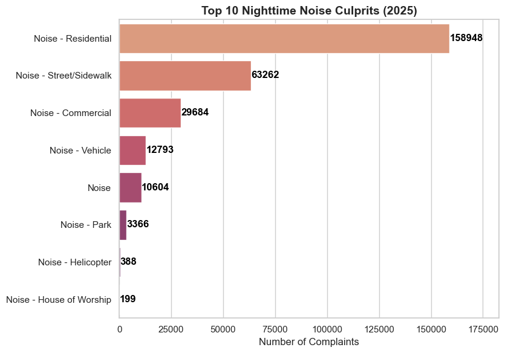
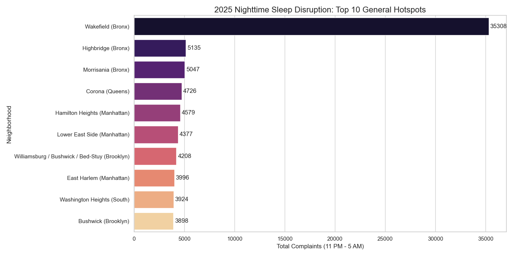
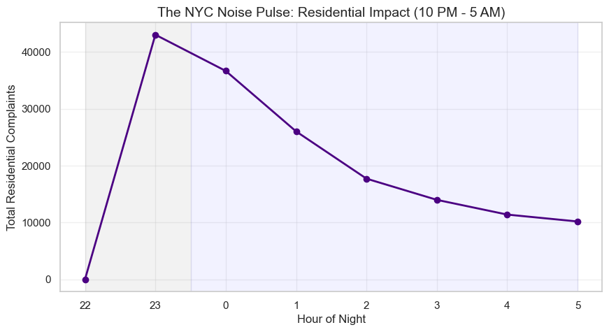
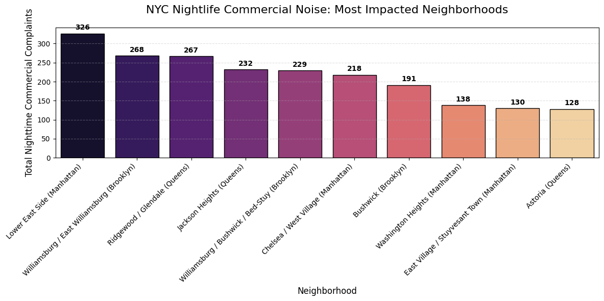
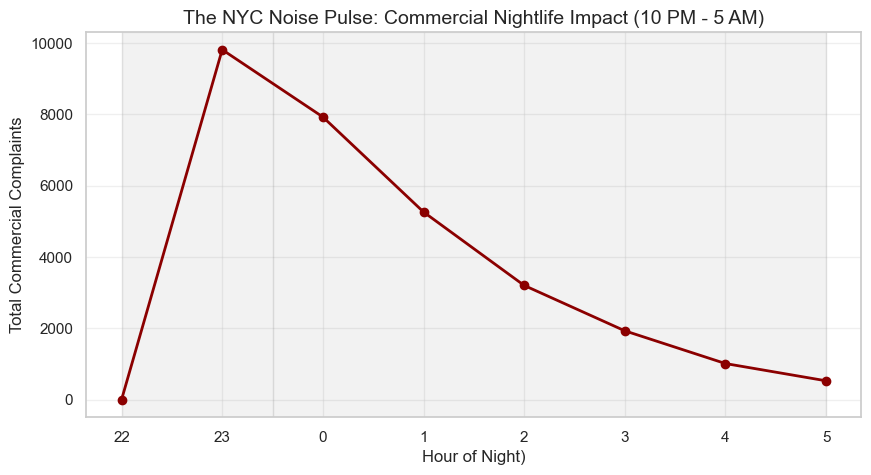

# 🌃  The 2015 NYC Nightlife Noise Pulse: A 10-Year Study (2015–2025)
## **_An Analysis of Commercial Disturbance and Residential Sleep Vulnerability_**

## 📌 Executive Summary (Historical Baseline: 2015)
This project analyzes **118,676** noise complaints to establish a 2015 historical baseline of NYC's nighttime commercial activity. By mapping **52,260** specific nighttime events **(11 PM – 5 AM)**, I identified the neighborhoods and hours where the city’s "nightlife pulse" was most intense a decade ago.

This analysis serves as the foundation for a comparative study against 2025 data, aiming to track the evolution of urban noise and its persistent risk to residential sleep vulnerability over a ten-year period.

### 🔍 Key Insights (2015)

**The 11 PM "Danger Zone":** Noise complaints across NYC peak sharply at 23:00 (11:00 PM). This is a critical urban health insight, as it coincides with the beginning of the most restorative residential sleep cycles.

**Top Hotspot - Inwood (10034):** Surpassing traditionally "loud" areas like the Lower East Side (10002), Inwood recorded 1,047 commercial noise events, making it the city's primary friction zone.

**The Brooklyn's Rise:** High-density commercial noise is no longer exclusive to Manhattan; Bed-Stuy (11216) and Prospect Heights (11238) now rank among the top 5 noise hotspots.

## 🗺️  2015 Geographic Distribution (The "Where")

Before diving into specific numbers, I mapped the total density of complaints. The heatmap reveals a concentrated "Noise Axis" running from Upper Manhattan through the East Village and into the Northern Brooklyn corridor.

👉 **[Explore the 2015 Live Interactive Heatmap](https://megwilliams17.github.io/Urban_Noise_-_Sleep/Historical_2015/nyc_sleep_risk_map.html)**
*(Note: This map is best viewed on a desktop browser for full interactivity.)*

**How to read this map:** 
Warmer colors indicate higher concentrations of nighttime commercial noise complaints. The intensity of Inwood (ZIP 10034) stands out despite its smaller size, visually confirming its role as NYC's primary nighttime noise hotspot.

**_Insight:_** The spatial density confirms that noise follows specific commercial corridors and gentrifying residential hubs rather than being randomly distributed.

## 📉  2015 The Nightly Pulse (The "When")

To understand the impact on residents, I analyzed the volume of complaints by hour. In NYC, commercial noise isn't a steady hum; it is a sharp spike that climbs through the evening.

  
  
<i>Figure 1: The 11 PM Pulse — Hourly distribution of commercial noise complaints.</i>

**_Insight:_** The data shows a massive surge starting at 10 PM and peaking at 11 PM before a slow decline into the early morning. This highlights a direct conflict between the late-night economy and the public health need for sleep.

## 📊  2015 Impact by Neighborhood (The "Who")

I mapped Zip Codes to actual neighborhood names to provide human context. While the Lower East Side is famous for its bars, the data shows that Inwood and Washington Heights are experiencing higher volumes of reported distress.

| Neighborhood | Zip Code | Complaint Count|
| :--- | :---| :--- |
|**Inwood / Washington Heights**|10034 |1,047 |
| **Lower East Side/ Chinatown** |10002 |833 | 
| **East Village / Alphabet City** | 10009 |816 | 
| **East Harlem** |10029 | 792 | 
|**Bed-Stuy (Brooklyn)** |11216 | 762 |

---

## 🚀 2025 Analysis: The New Frontier (Phase 2)

In 2025, I expanded the study to include **Residential Noise**, revealing a city that has not only gotten louder but has shifted its "Noise Axis" entirely.

### 🔍 Key Insights (2025)
- **Total Noise Complaints in 2025:** **199,556** (Successfully loaded for this analysis)
- **Total Nighttime Noise Events:** **63,640** (A significant increase in nighttime disruption compared to the 2015 baseline).
- **Growth Trend:** A **~69% increase** in city-wide noise reporting over a single decade.
- **The 10-Year Ranking Shift:** In 2015, **Inwood (10034)** was the #1 noise hotspot in NYC. By 2025, it dropped to **Rank #22** with 600 nighttime complaints, as the "Noise Axis" migrated toward the Bronx and Lower Manhattan.

- **2025 Nighttime Culprits (11 PM - 5 AM):**

| Complaint Type | Count |
| :--- | :--- |
| **Noise - Residential** | **43,771** |
| Noise - Street/Sidewalk | 8,004 |
| Noise - Commercial | 6,582 |
| Noise - Vehicle | 2,328 |
| Noise - Park/Other | 458 |

  
  
<i>Figure 3: General Night Noise Categories (2025).</i>

**_Insight:_** Residential noise is now the undisputed "King of Complaints," occurring at nearly **7x the volume** of commercial nightlife noise.

---

## 🗺️ 2025 Geographic Distribution (The Heatmap Shift)
The 2025 Heatmap reveals a dramatic migration of noise. While the 2015 map was centered on Upper Manhattan, the 2025 map shows the "Heat" has spread significantly into the **North Bronx** and **Northern Brooklyn**.

👉 **[Explore the 2025 Live Interactive Heatmap](https://megwilliams17.github.io/Urban_Noise_-_Sleep/Current_2025/nyc_general_sleep_risk_map_2025.html)**
*(Note: This map is best viewed on a desktop browser for full interactivity.)*

**_Spatial Insight:_** The 2025 heatmap confirms that noise is no longer just a "Manhattan Nightlife Problem." The density in **Wakefield (10466)** and **Bushwick (11237)** shows that residential areas are now facing the highest levels of nighttime disruption.

### **General Nighttime Hotspots (All Categories)**
When looking at every type of noise (Street, Commercial, Vehicle, etc.) between 11 PM and 5 AM, **Wakefield (10466)** stands as a massive statistical anomaly, recording over **15,000** more events than the next closest neighborhood.

  
  
<i>Figure 4: Top 10 General Night Noise Hotspots (2025).</i>

| Rank | Zip Code | Neighborhood | Complaint Count |
| :--- | :--- | :--- | :--- |
| **1** | **10466** | **Wakefield (Bronx)** | **15,728** |
| 2 | 11368 | Corona (Queens) | 1,189 |
| 3 | 10456 | Morrisania (Bronx) | 1,164 |
| 4 | 10002 | Lower East Side (Manhattan) | 954 |
| 5 | 11237 | Bushwick (Brooklyn) | 898 |
| 6 | 10031 | Hamilton Heights (Manhattan) | 828 |
| 7 | 11206 | Williamsburg/Stuy-Heights | 822 |
| 8 | 10029 | East Harlem (Manhattan) | 803 |
| 9 | 10468 | Fordham (Bronx) | 772 |
| 10 | 10458 | Belmont (Bronx) | 724 |

## 🏢 2025 Residential-Only Nighttime Hotspots
To pinpoint sleep vulnerability, I isolated **Residential-Only** noise. The Bronx now dominates the landscape, with Wakefield appearing as a massive statistical outlier.

| Rank | Zip Code | Neighborhood | Residential Complaints (11PM-5AM) |
| :--- | :--- | :--- | :--- |
| **1** | **10466** | **Wakefield (Bronx)** | **15,676** |
| 2 | 10456 | Morrisania (Bronx) | 1,047 |
| 3 | 10468 | Fordham (Bronx) | 653 |
| 4 | 10029 | East Harlem (Manhattan) | 585 |
| 5 | 10467 | Williamsbridge (Bronx) | 564 |
| 6 | 10452 | Highbridge (Bronx) | 490 |
| 7 | 10031 | Hamilton Heights (Manhattan) | 475 |
| 8 | 11233 | Bedford-Stuyvesant (Brooklyn) | 463 |
| 9 | 10458 | Belmont (Bronx) | 461 |
| 10 | 11226 | Flatbush (Brooklyn) | 455 |

**_Insight:_** In **Wakefield (10466)**, 99.6% of all nighttime noise is residential. This suggests a localized crisis that standard nightlife policing (focused on bars) will not solve.

## 📉 2025 The Residential Pulse (The "When")
Residential noise creates a high-volume "plateau" that disrupts sleep throughout the entire night, rather than just a single peak hour.

  
  
<i>Figure 5: The 2025 Residential Pulse — Sustained nighttime disruption.</i>

---

## 🍻 2025 Commercial Noise (The 10-Year Shift)
In 2025, the commercial "Noise Axis" shifted. While Inwood led in 2015, the **Lower East Side** and **North Brooklyn** now dominate the commercial nightlife landscape.

  
  
<i>Figure 6 Top 10 Commercial Noise Hotspots (2025).</i>

| Neighborhood | Zip Code | Commercial Count |
| :--- | :---| :--- |
|**Lower East Side**|10002 |326 |
| **Williamsburg** |11211 |268 | 
| **Ridgewood** | 11385 |267 | 

## 📉 2025 The Commercial Pulse
The commercial intensity has tripled over the decade. The "Pulse" still peaks at 11 PM but at a much more aggressive scale.

  
  
<i>Figure 7: The 2025 Commercial Pulse — The Nightlife Intensity.</i>

---

👉 **[Explore the 2025  Analytical Live Interactive Heatmap](https://megwilliams17.github.io/Urban_Noise_-_Sleep/Current_2025/NYC_Analysis_Heatmap_2025.html)**
*(Note: This map is best viewed on a desktop browser for full interactivity.)*

🎨 **Geospatial Color Theory**
To differentiate between two distinct datasets, I implemented a Dual-Gradient Strategy:
- **Residential (The Fire Palette):** Uses warm tones (`#6a0000` (Deep Maroon) → `#fee08b` (Neon Yellow ) )to visualize the "heat" of 311 calls. The gradient moves from Deep Maroon (Baseline) to Neon Yellow, pinpointing the extreme density of complaints in the North Bronx.
- **Commercial (The Neon Palette):** Uses electric tones (`#3f007d` (Dark Purple) → `#7fffd4` (Bright Cyan)) to isolate business noise. The gradient moves from Dark Purple (Quiet) to Bright Cyan, marking the city's high-traffic commercial corridors and nightlife districts.

## 🛠️  Methodology & The "Data Scientist Pivot"

- **2015 Audit:** A critical part of this project was a Data Integrity Audit.

- **The Problem:** I originally intended to compare Residential vs. Commercial noise ratios. However, I discovered that 'Residential' descriptors in this 311 subset were exclusively linked to Animal Welfare cases.

- **The Action:** To maintain scientific honesty, I pivoted to a Volume & Density Analysis of Commercial noise, ensuring the final results were accurate and verified.

- **2025 Expansion:** With improved NYC 311 metadata, I successfully separated Residential and Commercial noise, allowing for the first true comparative study of urban friction across a decade.

--- 

## 🚦  Final Conclusion & Recommendations

This 10-year study proves NYC is in a "Noise Explosion." While commercial noise at 11 PM has tripled, **Residential noise** in the Bronx has emerged as the single greatest threat to sleep health in 2025.

### **Historical Recommendations (Based on 2015 Data)**

1. **Targeted Enforcement:** Prioritize noise mitigation in the 10034 and 10002 zip codes specifically between 10 PM and Midnight.

2. **Acoustic Planning:** City planners should implement stricter soundproofing ordinances and acoustic mitigation for new commercial developments in the identified Top 10 Zip Codes.

### **Evolved Recommendations (Based on 2025 Data)**
1.  **The Wakefield Task Force:** Immediate investigation into the **10466 (Wakefield)** outlier. 15,000+ complaints suggest a systemic residential crisis requiring specific mediation rather than standard police response.
2.  **Dynamic Nightlife Buffer:** Shift commercial enforcement focus from Inwood to the **Lower East Side (10002)** and **Williamsburg (11211)**, focusing specifically on the "11 PM Pulse" window.
3.  **Data Integrity:** The city should continue the granular classification used in 2025, as the 2015 "Animal Welfare" classification gap proved how easily residential suffering can be hidden in data.

## **🚀 The Future Work:** 
I am now building an interactive **Geospatial Dashboard** in the `Comparison_Report/` folder to allow users to visualize this 10-year noise migration in real-time.